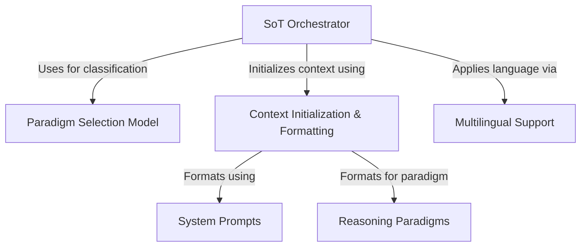

# Tutorial: SoT

The **Sketch-of-Thought (SoT)** project provides a library to help Large Language Models (LLMs) reason more *efficiently*.
Instead of long explanations, it uses specific **reasoning strategies** (called *Paradigms*) like *Conceptual Chaining*, *Chunked Symbolism*, or *Expert Lexicons*, depending on the type of question.
It includes a **model** to automatically pick the best strategy for a given question and prepares the input for the LLM, including instructions (*System Prompts*) and examples, even supporting **multiple languages**.

**Source Repository:** [https://github.com/bta4935/SoT](https://github.com/bta4935/SoT)

## Chapters

1. [Reasoning Paradigms
](01_reasoning_paradigms_.md)
2. [SoT Orchestrator
](02_sot_orchestrator_.md)
3. [Paradigm Selection Model
](03_paradigm_selection_model_.md)
4. [Context Initialization & Formatting
](04_context_initialization___formatting_.md)
5. [System Prompts
](05_system_prompts_.md)
6. [Multilingual Support
](06_multilingual_support_.md)

---

Generated by [AI Codebase Knowledge Builder](https://github.com/The-Pocket/Tutorial-Codebase-Knowledge)