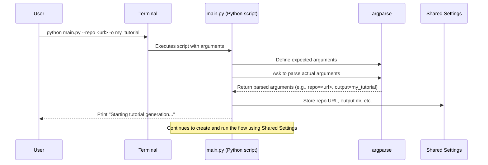

# Chapter 1: CLI & Configuration

Welcome to the `Tutorial-Codebase-Knowledge` project! 🎉
This project helps you automatically create tutorials for codebases.
Think of it like a smart assistant that reads code and writes explanations.

This first chapter is all about how *you* tell this assistant what to do. We'll explore the **Command-Line Interface (CLI)** and how you **configure** the tutorial generation process.

## What's the Point? The Control Panel

Imagine you have a complex machine, maybe a fancy coffee maker. It has buttons
and dials to choose the coffee type, strength, and cup size. The **CLI** is like
the control panel for our tutorial generator. It's how you give instructions.

**Use Case:** Let's say you have a project on GitHub, like
`https://github.com/your-username/cool-project`, and you want to generate a
 tutorial for it. You also want the tutorial files to be saved in a specific
folder on your computer, say `my_project_tutorial`. How do you tell the
 generator *which* project to use and *where* to save the output? That's where
 the CLI and configuration come in!

## Key Concepts: Giving Instructions

### 1. The Command Line (Your Terminal)

The Command-Line Interface (CLI) usually refers to your **terminal** or
**console** application. It's a text-based way to interact with your computer
and run programs. Instead of clicking buttons, you type commands.

```bash
# This is what a command line might look like
$ _
```

When we talk about running the tutorial generator, you'll be typing commands
into a window like this.

### 2. Arguments: The Instructions Themselves

Arguments (or flags or options) are the specific instructions you add to your
command. They usually start with `-` or `--`.

Think of them like options on that coffee maker:

* `--strength strong`
* `--size large`

For our tutorial generator, common arguments include:

* `--repo <URL>`: Tells the generator to use a GitHub repository.
* `--dir <PATH>`: Tells the generator to use a local folder on your computer.
* `-o <FOLDER>` (or `--output <FOLDER>`): Specifies where to save the generated
  tutorial.

### 3. Required vs. Optional

Some instructions are essential, while others are optional tweaks.

* **Required:** You *must* tell the generator what code to look at. So, you
*have* to provide either `--repo` OR `--dir`. You can't use both at the same
 time (they are *mutually exclusive*).
* **Optional:** You don't *have* to tell it where to save the output. If you
 don't specify `--output`, it will use a default folder named `output`. Many
 other arguments like filtering files (`--include`, `--exclude`) are also
 optional.

### 4. Choosing Your Code Source (`--repo` vs. `--dir`)

You need to tell the generator where the code lives.

* **GitHub:** Use `--repo` followed by the full URL.

    ```bash
    python main.py --repo https://github.com/your-username/cool-project
    ```

* **Local Folder:** Use `--dir` followed by the path to the folder on your computer.

    ```bash
    # On Linux/macOS
    python main.py --dir /home/user/projects/cool-project
    # On Windows
    python main.py --dir C:\Users\User\Projects\cool-project
    ```

    Remember, you must pick one – either `--repo` or `--dir`.

### 5. Filtering Files (`--include`, `--exclude`)

Sometimes, codebases have files you *don't* want in the tutorial (like tests, build files, or documentation). Other times, you might only want to focus on specific file types (like only Python `.py` files).

* `--include`: Specifies patterns for files you *want* to include. If you don't
 use this, it uses a helpful list of common code file types (like `.py`, `.js`,
 `.java`, etc.).
* `--exclude`: Specifies patterns for files or folders you *want* to ignore. If
 you don't use this, it uses a default list to ignore common things like
 `tests/`, `.git/`, `node_modules/`.

Patterns often use wildcards (`*`) like `*.py` (all files ending in .py) or `tests/*` (everything inside the `tests` folder).

```bash
# Example: Only include Python files, exclude tests and docs
python main.py --dir ./my_project --include "*.py" --exclude "tests/*" "docs/*"
```

### 6. Setting the Output (`--output`)

By default, the tutorial files are saved in a folder named `output` in the
 directory where you run the command. You can change this using the `-o` or
 `--output` argument.

```bash
# Save the tutorial in a folder named "generated_docs"
python main.py --repo <repo_url> -o generated_docs
```

### 7. Other Handy Options

* `--token`: Your GitHub Personal Access Token. Needed for private repos or to
 avoid rate limits on public repos. It can also be set using an environment
 variable (`GITHUB_TOKEN`).
* `--name`: Give your project a specific name in the tutorial (otherwise, it's
 guessed from the repo/folder name).
* `--max-size`: Ignore files larger than a certain size (in bytes). Useful for
 skipping huge data files.
* `--language`: Choose the language for the generated tutorial (e.g.,
 `--language spanish`). Default is English.

## How to Use It: Generating Your First Tutorial

Let's revisit our use case: Generate a tutorial for
`https://github.com/your-username/cool-project` and save it in
`my_project_tutorial`.

Here’s the command you would type in your terminal:

```bash
python main.py --repo https://github.com/your-username/cool-project -o my_project_tutorial
```

What if your project was local in a folder called `awesome-code`?

```bash
python main.py --dir ./awesome-code -o my_project_tutorial
```

What if you only wanted to include `.py` files and `.md` files, and exclude
anything in a `build/` directory?

```bash
python main.py --dir ./awesome-code \
    -o my_project_tutorial \
    --include "*.py" "*.md" \
    --exclude "build/*"
```

*(Note: The `\` just lets you split a long command onto multiple lines in many terminals).*

When you run these commands, the script `main.py` starts up, reads your
instructions (arguments), and begins the process detailed in
[Tutorial Generation Flow](02_tutorial_generation_flow_.md). You'll see messages
printed to your terminal about its progress.

## Under the Hood: How `main.py` Understands You

How does the Python script (`main.py`) actually understand commands like
`--repo` or `-o`? It uses a built-in Python library called `argparse`.

**High-Level Steps:**

1. **You run the command:** `python main.py --repo <url> ...`
2. **Python starts `main.py`:** The script begins executing.
3. **`argparse` takes over:** The script tells `argparse` about all the possible arguments (`--repo`, `--dir`, `-o`, etc.), which ones are required, and their types.
4. **Parsing:** `argparse` reads the arguments you actually provided in the command line.
5. **Storing:** It stores these values neatly (e.g., it knows the value for `--repo` is `<url>`).
6. **Using the values:** The script then uses these stored values to configure the tutorial generation process (e.g., knowing which repository to fetch, where to save files).

**Diagram:**



**Code Dive:**

Let's peek inside `main.py`.

First, we create an "argument parser":

```python
# File: main.py
import argparse
import os
# ... other imports

def main():
    # Create the main parser object
    parser = argparse.ArgumentParser(
        description="Generate a tutorial for a GitHub codebase or local directory."
    )
    # ... arguments are defined below ...
```

This sets up the tool that will understand our command-line instructions.

Then, we define the arguments we expect. For `--repo` and `--dir`, we make them mutually exclusive (only one can be used):

```python
# File: main.py (inside main function)

    # Create mutually exclusive group for source (repo OR dir)
    source_group = parser.add_mutually_exclusive_group(required=True)
    source_group.add_argument("--repo", help="URL of the public GitHub repository.")
    source_group.add_argument("--dir", help="Path to local directory.")
```

`required=True` means the user *must* provide either `--repo` or `--dir`.

We define optional arguments like `--output` (`-o` is a shorthand) and give it a default value:

```python
# File: main.py (inside main function)

    # Define the output directory argument
    parser.add_argument(
        "-o", "--output",        # Short (-o) and long (--output) names
        default="output",        # Default value if user doesn't provide it
        help="Base directory for output (default: ./output)."
    )
```

Arguments like `--include` and `--exclude` can accept multiple values (`nargs="+`):

```python
# File: main.py (inside main function)

    # Define include patterns (can take multiple values)
    parser.add_argument(
        "-i", "--include",
        nargs="+",  # '+' means one or more arguments
        help="Include file patterns (e.g. '*.py' '*.js')."
    )
```

Finally, after defining all arguments, we tell `argparse` to read the command line:

```python
# File: main.py (inside main function)

    # Parse the arguments provided by the user
    args = parser.parse_args()
```

The results are stored in the `args` variable. For example, if you ran `python main.py --repo <url> -o my_docs`, then `args.repo` would be `<url>` and `args.output` would be `my_docs`.

The script then takes these values from `args` and puts them into a shared dictionary (`shared`) that other parts of the generator will use:

```python
# File: main.py (inside main function)

    # Initialize the shared dictionary with inputs from args
    shared = {
        "repo_url": args.repo,
        "local_dir": args.dir,
        "output_dir": args.output,
        "include_patterns": set(args.include) if args.include else DEFAULT_INCLUDE_PATTERNS,
        "exclude_patterns": set(args.exclude) if args.exclude else DEFAULT_EXCLUDE_PATTERNS,
        # ... other settings ...
        "language": args.language,
    }

    # ... rest of the script uses the 'shared' dictionary ...
```

This `shared` dictionary acts as a central place for all configuration settings needed during the tutorial generation.

## Conclusion

You've learned how to use the Command-Line Interface (CLI) to control the tutorial generator. By using arguments like `--repo`, `--dir`, `-o`, `--include`, and `--exclude`, you can tell the generator exactly *what* code to analyze and *how* you want the tutorial created. This configuration step is essential for tailoring the process to your specific needs.

You now understand how to start the generation process. But what actually happens after you hit Enter? How does the code get fetched, analyzed, and turned into a tutorial?

Let's dive into the overall process in the next chapter: [Tutorial Generation Flow](02_tutorial_generation_flow_.md).

---

Generated by [AI Codebase Knowledge Builder](https://github.com/The-Pocket/Tutorial-Codebase-Knowledge)
