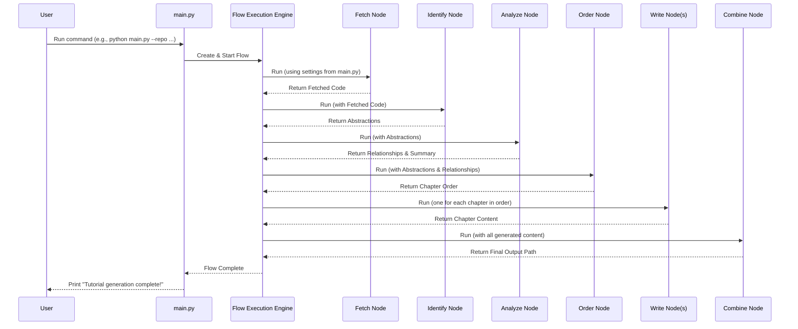

# Chapter 2: Tutorial Generation Flow

In [Chapter 1: CLI & Configuration](01_cli___configuration_.md), you learned how to give instructions to our tutorial generator using the command line. You told it *what* code to look at (like a GitHub repo or a local folder) and *where* to save the output.

But what happens after you press Enter? How does the generator actually take the code and magically turn it into a helpful tutorial? That's what this chapter is all about: the **Tutorial Generation Flow**.

## What's the Point? The Recipe for Making Tutorials

Imagine you're baking a cake. You don't just throw all the ingredients into a bowl and hope for the best! You follow a recipe: mix the dry ingredients, then the wet, combine them, bake, and finally frost. Each step depends on the previous one.

The **Tutorial Generation Flow** is like the recipe for our tutorial generator. It defines the exact sequence of steps (or tasks) needed to create the tutorial. It ensures that we fetch the code *before* analyzing it, analyze it *before* writing about it, and so on. Without a clear flow, the process would be chaotic and wouldn't produce a useful result.

**Use Case:** You run the command from Chapter 1: `python main.py --repo https://github.com/your-username/cool-project -o my_project_tutorial`. How does the system ensure it first downloads the code, then figures out the important parts, then decides the chapter order, *then* writes the chapters, and finally puts everything together in the `my_project_tutorial` folder? The Tutorial Generation Flow manages this precise order.

## Key Concepts: The Steps in Our Recipe

### 1. What is a Flow? (The Recipe)

Think of the **Flow** as the master plan or the main recipe. It dictates the overall order of operations. It's not just a random list of tasks; it defines how the tasks connect and pass information between them.

* **Analogy:** An assembly line in a factory. Each station does one specific job, and the product moves from one station to the next in a defined sequence.

### 2. What are Nodes? (The Recipe Steps / Assembly Stations)

Each individual task or step within the flow is called a **Node**. Each node has a specific job to do.

* **Analogy:** In our cake recipe, "mixing dry ingredients" is one node, "baking" is another node. On the assembly line, one station might install the wheels, another installs the engine.

Our tutorial generator uses several nodes:

* A node to fetch the code.
* A node to identify the key concepts (abstractions) in the code using AI.
* A node to analyze how these concepts relate to each other.
* A node to decide the best order to present these concepts (chapter order).
* A node (or set of nodes) to write the actual content for each chapter using AI.
* A node to combine everything into the final tutorial files.

We'll explore these nodes in more detail in [Chapter 5: Processing Nodes](05_processing_nodes_.md).

### 3. Connecting Nodes: Passing the Baton

The magic of the flow is how the nodes are connected. The output of one node becomes the input for the next node in the sequence.

* **Analogy:** When you finish mixing the cake batter (output of the mixing node), that batter becomes the input for the baking node. The finished car chassis (output of the chassis station) moves to the engine installation station (input for the engine node).

In our generator:

1. The `FetchRepo` node outputs the code files.
2. These code files are passed as input to the `IdentifyAbstractions` node.
3. The list of abstractions identified becomes the input for the `AnalyzeRelationships` node.
4. ...and so on.

This ensures that each step has the information it needs from the previous step.

### 4. Our Specific Recipe: The Main Steps

The `Tutorial-Codebase-Knowledge` project uses the following main steps (nodes) in its flow:

1. **Fetch Code (`FetchRepo` / `FetchLocal`)**: Gets the source code either from GitHub or a local directory based on your CLI arguments (`--repo` or `--dir`).
2. **Identify Abstractions (`IdentifyAbstractions`)**: Reads the code and uses an AI (Large Language Model or LLM) to figure out the 5-10 most important concepts or "abstractions" a beginner should learn about.
3. **Analyze Relationships (`AnalyzeRelationships`)**: Looks at the identified abstractions and the code again, asking the AI how these concepts connect and interact with each other. It also generates a project summary.
4. **Order Chapters (`OrderChapters`)**: Based on the abstractions and their relationships, asks the AI to determine the most logical order to explain these concepts in the tutorial chapters.
5. **Write Chapters (`WriteChapters`)**: For each abstraction (in the determined order), asks the AI to write a detailed, beginner-friendly tutorial chapter explaining that concept, referencing the relevant code.
6. **Combine Tutorial (`CombineTutorial`)**: Takes all the generated chapter content, creates an index file (`index.md`) with a summary and chapter list, and saves everything neatly into the output folder you specified (or the default `output/` folder).

## Under the Hood: Defining the Flow in Code

How is this sequence actually defined in our Python project? We use a library called `pocketflow`, and the main recipe is written down in the `flow.py` file.

### Non-Code Walkthrough: The Journey of Your Request

When you run `python main.py ...`, here's a simplified step-by-step journey:

1. `main.py` reads your command-line arguments (Chapter 1).
2. It sets up the "shared" settings (like the repo URL, output folder).
3. It asks `flow.py` to create the tutorial generation flow.
4. `flow.py` defines the sequence of nodes (Fetch -> Identify -> Analyze -> Order -> Write -> Combine).
5. `main.py` starts the flow.
6. The `Fetch` node runs, downloads the code, and passes it to the next node.
7. The `Identify` node runs, gets the code, asks the AI, and passes the list of abstractions onwards.
8. This continues step-by-step until the `Combine` node finishes writing the files.

Here's a diagram showing this sequence:



### Code Dive: `flow.py`

Let's peek inside `flow.py` to see how this flow is actually coded.

First, it imports the `Flow` object and all the specific `Node` classes defined in `nodes.py` (we'll cover nodes in Chapter 5).

```python
# File: flow.py
from pocketflow import Flow
# Import all node classes from nodes.py
from nodes import (
    FetchRepo,
    IdentifyAbstractions,
    AnalyzeRelationships,
    OrderChapters,
    WriteChapters,
    CombineTutorial
)
```

* `pocketflow` is the library helping us manage the flow.
* `nodes` is our file containing the code for each step (like `FetchRepo`, `IdentifyAbstractions`, etc.).

Then, a function `create_tutorial_flow()` builds the recipe:

```python
# File: flow.py
def create_tutorial_flow():
    """Creates and returns the codebase tutorial generation flow."""

    # Instantiate nodes (Create an object for each step)
    fetch_repo = FetchRepo()
    identify_abstractions = IdentifyAbstractions(max_retries=5, wait=20)
    analyze_relationships = AnalyzeRelationships(max_retries=5, wait=20)
    order_chapters = OrderChapters(max_retries=5, wait=20)
    write_chapters = WriteChapters(max_retries=5, wait=20)
    combine_tutorial = CombineTutorial()
    # (Note: max_retries etc. are configurations for handling potential errors)
```

* This part creates an instance (a working copy) of each node class. Think of it as getting out the tools needed for each step of the recipe.

Next, it connects the nodes in the desired sequence using the `>>` operator:

```python
# File: flow.py (inside create_tutorial_flow)

    # Connect nodes in sequence based on the design
    fetch_repo >> identify_abstractions
    identify_abstractions >> analyze_relationships
    analyze_relationships >> order_chapters
    order_chapters >> write_chapters
    write_chapters >> combine_tutorial
```

* This `>>` literally means "the output of the node on the left becomes the input for the node on the right". This defines the exact order of operations.

Finally, it creates the `Flow` object, telling it which node starts the whole process:

```python
# File: flow.py (inside create_tutorial_flow)

    # Create the flow starting with FetchRepo
    tutorial_flow = Flow(start=fetch_repo)

    return tutorial_flow
```

* This bundles everything up into a single `Flow` object that `main.py` can then run.

## Diagram: The Tutorial Flow

Here's a visual representation of the flow defined in `flow.py`:

```mermaid
flowchart TD
    Start([Start]) --> A[Fetch Code<br>(FetchRepo)];
    A --> B(Identify Abstractions<br>(IdentifyAbstractions));
    B --> C(Analyze Relationships<br>(AnalyzeRelationships));
    C --> D(Order Chapters<br>(OrderChapters));
    D --> E(Write Chapters<br>(WriteChapters));
    E --> F(Combine Tutorial<br>(CombineTutorial));
    F --> End([End]);
```

## Conclusion

You've now seen the "recipe" or the **Tutorial Generation Flow** that our project follows. It's a carefully defined sequence of steps (nodes) where each step builds upon the results of the previous one. This flow ensures that we go from raw source code to a structured, well-ordered tutorial in a predictable way.

Key takeaways:

* The process isn't one big step, but a sequence of smaller tasks (nodes).
* This sequence (the flow) is crucial for getting the right results.
* Each node performs a specific function (fetch, analyze, write, etc.).
* The output of one node feeds into the next.
* This flow is defined in `flow.py` using the `pocketflow` library.

Now that you understand the overall process, what does the final output actually look like? What files are created, and how are they structured?

Let's explore that in the next chapter: [Tutorial Structure & Output](03_tutorial_structure___output_.md).

---

Generated by [AI Codebase Knowledge Builder](https://github.com/The-Pocket/Tutorial-Codebase-Knowledge)
