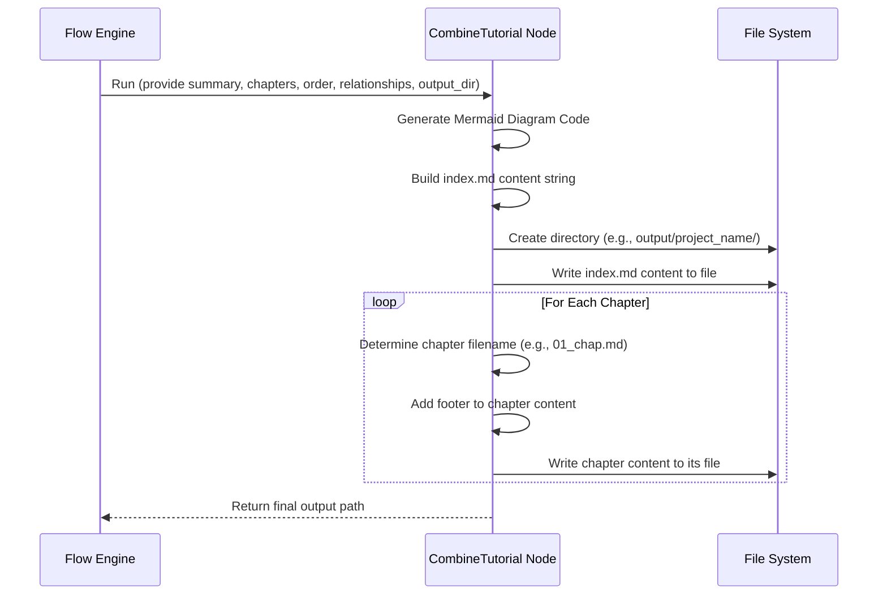

# Chapter 3: Tutorial Structure & Output

Okay, let's recap our journey so far!

1. In [Chapter 1: CLI & Configuration](01_cli___configuration_.md), we learned how to tell our tutorial generator *what* code project to look at and *how* we want the tutorial built (like setting the output folder).
2. In [Chapter 2: Tutorial Generation Flow](02_tutorial_generation_flow_.md), we saw the step-by-step recipe the generator follows: fetch code, identify concepts, figure out relationships, decide chapter order, and write the chapters.

But wait! After the AI writes all those chapter explanations, they're still just separate pieces of text floating around inside the computer's memory. How do they become a neat, organized tutorial that you can actually read and navigate?

That's where this final step comes in: **Tutorial Structure & Output**. Think of it as the publishing house taking the author's manuscript (the generated chapters) and the cover design (project summary, diagram) and binding them into a finished book that readers can easily use.

## What's the Point? Assembling the Final Book

Imagine you've baked all the layers of a cake (wrote the chapters), made the frosting (project summary), and figured out how the layers stack (chapter order). Now you need to actually put it all together, frost it, and put it on a nice platter so someone can enjoy it!

The **Tutorial Structure & Output** stage does exactly that for our generated tutorial. It takes all the individual pieces created by the previous steps in the flow and organizes them into a set of user-friendly Markdown files, complete with an index page to help you navigate.

**Use Case:** You ran the command `python main.py --repo <url> -o my_tutorial`. The generator finished writing Chapter 1, Chapter 2, etc., and figured out the project summary. How does it actually create the `my_tutorial` folder? How does it create the `index.md` file inside it? How does it save each chapter into files like `01_intro.md`, `02_setup.md`? This final assembly step handles all of that.

## Key Concepts: The Parts of Our Finished Tutorial

### 1. The Assembler: The `CombineTutorial` Node

Remember the "nodes" from Chapter 2, which were like stations on an assembly line? The very last node in our flow is called `CombineTutorial`. Its one job is to take everything generated before it and put it all together into the final output files. It's the "publisher" or "assembler" of our tutorial.

### 2. What Goes In? (The Ingredients)

The `CombineTutorial` node receives several key pieces of information from the previous steps:

* **Project Name:** The name you gave the project (or the one guessed from the repo/folder).
* **Project Summary:** The short description of the project written by the AI.
* **Relationship Info:** How the different concepts (chapters) relate to each other, including the Mermaid diagram code.
* **Chapter Order:** The sequence in which the chapters should be presented.
* **Chapter Content:** The actual Markdown text written by the AI for each chapter.
* **Output Directory:** The folder path where the tutorial should be saved (from the `-o` argument or the default `output/`).

### 3. What Comes Out? (The Final Product)

When `CombineTutorial` finishes its work, you'll find a new folder created on your computer. Here’s what it typically looks like:

```bash
your_project_folder/
└── output/                      <-- Default output base folder
    └── your_project_name/       <-- Folder named after your project
        ├── index.md             <-- The main entry point/table of contents
        ├── 01_first_concept.md  <-- Chapter 1 file
        ├── 02_second_concept.md <-- Chapter 2 file
        ├── 03_another_topic.md  <-- Chapter 3 file
        └── ... (more chapters)
```

* **Project Folder:** A folder named after your project is created inside the specified output directory (`output/` by default).
* **`index.md`:** This is the "Table of Contents" or the main page of your tutorial.
* **Chapter Files (`.md`):** Each chapter gets its own Markdown file. The filename usually starts with a number (like `01_`, `02_`) to keep them in order, followed by a simplified version of the chapter's title (e.g., `first_concept`).

### 4. Inside `index.md`: The Table of Contents

The `index.md` file is designed to give you a quick overview and help you navigate the tutorial. It typically contains:

* **Project Title:** e.g., `# Tutorial: cool-project`
* **Project Summary:** The AI-generated summary explaining what the project does.
* **Source Link:** A link back to the original GitHub repository or local folder.
* **Relationship Diagram:** The Mermaid diagram showing how the main concepts connect.
* **Chapter List:** A numbered list of all the chapters, with each chapter title linking directly to its corresponding `.md` file (e.g., `1. [First Concept](01_first_concept.md)`).
* **Attribution:** A small note at the bottom saying the tutorial was generated by this tool.

### 5. Inside Chapter Files: The Content

Each chapter file (e.g., `01_first_concept.md`) contains:

* **Chapter Content:** The detailed, beginner-friendly explanation of that specific concept, including analogies, code snippets, diagrams, and links to other chapters, exactly as written by the AI in the `WriteChapters` step.
* **Attribution:** The same small note at the bottom saying the tutorial was generated by this tool.

## Under the Hood: How `CombineTutorial` Assembles the Tutorial

Let's peek behind the curtain and see how the `CombineTutorial` node actually works.

### Non-Code Walkthrough: Step-by-Step Assembly

1. **Gather Ingredients:** The node receives all the necessary data (summary, chapter text, order, relationships, output path) from the previous steps via the shared `shared` dictionary.
2. **Create Output Folder:** It creates the final directory structure (e.g., `output/your_project_name/`) using the project name and the specified output path.
3. **Build Relationship Diagram:** It takes the relationship information (which concepts connect and how) and formats it into the text-based code needed for a Mermaid diagram.
4. **Build `index.md` Content:** It pieces together the text for the `index.md` file: adds the title, pastes in the summary, adds the source link, includes the Mermaid diagram code, and creates the numbered list of chapters with links based on the chapter order and names.
5. **Write `index.md`:** It saves this combined text into the `index.md` file within the output folder.
6. **Process Chapters:** It loops through the generated chapter content, following the determined chapter order.
7. **Determine Filename:** For each chapter, it creates a filename like `01_concept_name.md`, using the chapter number and a cleaned-up version of the chapter title.
8. **Add Footer:** It adds the standard attribution line to the end of the chapter's Markdown content.
9. **Write Chapter File:** It saves the chapter's content (with the added footer) into its corresponding `.md` file in the output folder.
10. **Done!** Once all files are written, the process is complete, and the path to the output folder is reported.

Here's a simplified sequence diagram:



### Code Dive: `nodes.py` (`CombineTutorial` class)

Let's look at the actual code in `nodes.py` that performs this assembly.

**1. Preparing the Data (`prep` method):**

The `prep` method gathers all the needed information from the `shared` dictionary and prepares the content before writing any files.

```python
# File: nodes.py (Inside CombineTutorial class)
class CombineTutorial(Node):
    def prep(self, shared):
        # Get data from shared state
        project_name = shared["project_name"]
        output_base_dir = shared.get("output_dir", "output")
        output_path = os.path.join(output_base_dir, project_name)
        relationships_data = shared["relationships"] # Includes summary & relationship details
        chapter_order = shared["chapter_order"]
        abstractions = shared["abstractions"] # List of {'name': ..., 'description': ..., 'files': ...}
        chapters_content = shared["chapters"] # List of Markdown strings
        repo_url = shared.get("repo_url")

        # --- Generate Mermaid Diagram ---
        mermaid_lines = ["flowchart TD"]
        # Add nodes (abstractions)
        for i, abstr in enumerate(abstractions):
            node_id = f"A{i}"
            sanitized_name = abstr['name'].replace('"', '') # Clean name for Mermaid
            mermaid_lines.append(f'    {node_id}["{sanitized_name}"]')
        # Add edges (relationships)
        for rel in relationships_data['details']:
            from_node_id = f"A{rel['from']}"
            to_node_id = f"A{rel['to']}"
            edge_label = rel['label'].replace('"', '').replace('\n', ' ') # Clean label
            # ... (shorten label if too long) ...
            mermaid_lines.append(f'    {from_node_id} -- "{edge_label}" --> {to_node_id}')
        mermaid_diagram = "\n".join(mermaid_lines)
        # --- End Mermaid ---

        # --- Prepare index.md content ---
        index_content = f"# Tutorial: {project_name}\n\n"
        index_content += f"{relationships_data['summary']}\n\n" # Add the summary
        if repo_url:
             index_content += f"**Source Repository:** [{repo_url}]({repo_url})\n\n"
        index_content += "```mermaid\n" + mermaid_diagram + "\n```\n\n" # Add the diagram
        index_content += f"## Chapters\n\n"

        chapter_files = [] # To store info needed for writing chapter files later
        # Generate chapter list and prepare chapter file data
        for i, abstraction_index in enumerate(chapter_order):
            # ... (get abstraction name, create safe filename like 01_concept.md) ...
            abstraction_name = abstractions[abstraction_index]["name"]
            safe_name = "".join(c if c.isalnum() else '_' for c in abstraction_name).lower()
            filename = f"{i+1:02d}_{safe_name}.md"
            # Add link to index content
            index_content += f"{i+1}. [{abstraction_name}]({filename})\n"

            # Prepare chapter content with footer
            chapter_content = chapters_content[i]
            # ... (add attribution footer) ...
            chapter_files.append({"filename": filename, "content": chapter_content})

        # ... (add attribution footer to index_content) ...

        # Return everything needed by the 'exec' method
        return {
            "output_path": output_path,
            "index_content": index_content,
            "chapter_files": chapter_files # List of {"filename": str, "content": str}
        }
```

* It retrieves the summary, chapter content, order, etc. from `shared`.
* It builds the `mermaid_diagram` string.
* It constructs the `index_content` string, including the chapter list with links.
* It prepares a list called `chapter_files`, where each item contains the final filename and the full content (including the footer) for one chapter.

**2. Writing the Files (`exec` method):**

The `exec` method takes the prepared data and performs the actual file writing operations.

```python
# File: nodes.py (Inside CombineTutorial class)
    def exec(self, prep_res):
        output_path = prep_res["output_path"]
        index_content = prep_res["index_content"]
        chapter_files = prep_res["chapter_files"]

        print(f"Combining tutorial into directory: {output_path}")
        # Create the output directory if it doesn't exist
        os.makedirs(output_path, exist_ok=True)

        # Write index.md
        index_filepath = os.path.join(output_path, "index.md")
        with open(index_filepath, "w", encoding="utf-8") as f:
            f.write(index_content)
        print(f"  - Wrote {index_filepath}")

        # Write chapter files
        for chapter_info in chapter_files:
            chapter_filepath = os.path.join(output_path, chapter_info["filename"])
            with open(chapter_filepath, "w", encoding="utf-8") as f:
                f.write(chapter_info["content"])
            print(f"  - Wrote {chapter_filepath}")

        return output_path # Return the final path
```

* It gets the prepared `output_path`, `index_content`, and `chapter_files` list from `prep_res`.
* It uses `os.makedirs(..., exist_ok=True)` to safely create the output folder.
* It opens `index.md` for writing (`"w"`) and writes the prepared `index_content`.
* It loops through the `chapter_files` list. For each item, it joins the `output_path` with the `filename` to get the full path, opens that file for writing, and writes the prepared chapter `content`.

**3. Finishing Up (`post` method):**

The `post` method simply takes the result of `exec` (the final output path) and stores it back in the `shared` dictionary, and prints a success message.

```python
# File: nodes.py (Inside CombineTutorial class)
    def post(self, shared, prep_res, exec_res):
        shared["final_output_dir"] = exec_res # Store the output path
        print(f"\nTutorial generation complete! Files are in: {exec_res}")
```

## Conclusion

You've now seen the final stage of the tutorial generation process! The `CombineTutorial` node acts like a publisher, taking all the pieces generated by the AI and previous steps (chapters, summary, diagram structure) and assembling them into a neat, organized, and navigable set of Markdown files in your specified output folder.

Key takeaways:

* This is the final assembly step performed by the `CombineTutorial` node.
* It takes generated content (chapters, summary, relationships) as input.
* It produces an output folder containing an `index.md` file and individual chapter `.md` files.
* `index.md` acts as the table of contents with summary, diagram, and chapter links.
* Chapter files contain the detailed AI-written explanations.
* The code uses standard Python file operations (`os.makedirs`, `open`, `write`) to create the final output.

We've covered how to start the process (Chapter 1), the overall flow (Chapter 2), and how the final output is assembled (Chapter 3). Now, let's circle back and start digging into the details of *how* the generator performs the earlier steps in the flow.

Next up, we'll look at the very first task: getting the code itself! Let's explore [Chapter 4: Code Source Crawling](04_code_source_crawling_.md).

---

Generated by [AI Codebase Knowledge Builder](https://github.com/The-Pocket/Tutorial-Codebase-Knowledge)
