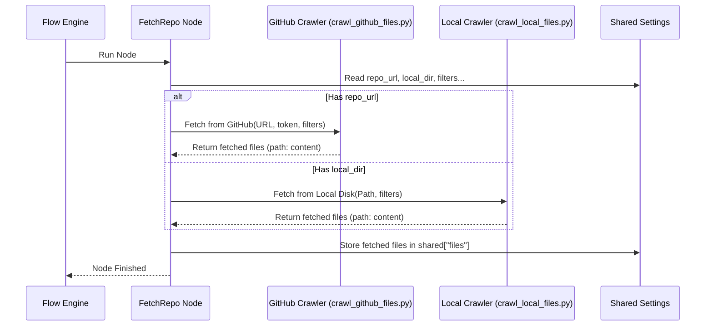

# Chapter 4: Code Source Crawling

Welcome back! In the previous chapters, we explored:

1. How to give instructions using the [CLI & Configuration](01_cli___configuration_.md).
2. The overall step-by-step recipe in the [Tutorial Generation Flow](02_tutorial_generation_flow_.md).
3. How the final [Tutorial Structure & Output](03_tutorial_structure___output_.md) is assembled.

Now, let's dive into the *first actual step* of that recipe: getting the source code! This chapter is all about **Code Source Crawling**.

## What's the Point? Fetching the Books

Imagine you want to write a report about a specific set of books in a library. What's the very first thing you need to do? You need to *get the books*! You can't write about them if you don't have them in front of you.

**Code Source Crawling** is like the librarian for our tutorial generator. Its job is to go and fetch all the necessary "books" (the source code files) that the tutorial will explain. Without this step, the AI wouldn't have any code to analyze or write about.

**Use Case:** You told the generator `python main.py --repo https://github.com/your-username/cool-project` (from Chapter 1). How does the system actually download the code files from that GitHub URL? Or, if you used `--dir /path/to/local/code`, how does it read the files from your computer? The Code Source Crawling component handles exactly this fetching process. It's the crucial first action in the [Tutorial Generation Flow](02_tutorial_generation_flow_.md).

## Key Concepts: How the Librarian Works

### 1. The Librarian Node: `FetchRepo`

Remember the "nodes" from Chapter 2, which are like steps in our recipe? The specific node responsible for fetching the code is called **`FetchRepo`**. Even if you provide a local directory (`--dir`), this node handles it (the name is a bit historical, think of it as "Fetch Code Source"). It's the very first node that runs in the flow.

### 2. Where's the Code? GitHub vs. Local Disk

How does `FetchRepo` know where to look? It uses the instructions you provided on the command line (Chapter 1):

* **Using GitHub (`--repo`):** If you provide a `--repo <URL>` argument, `FetchRepo` knows it needs to connect to GitHub.
  * It uses the URL you gave it.
  * If the repository is private, or if you want to avoid hitting GitHub's public limits, it will use the `--token` you provided (or the `GITHUB_TOKEN` environment variable).
  * It uses the GitHub API (a way for programs to talk to GitHub) or sometimes Git cloning to download the files.
* **Using a Local Folder (`--dir`):** If you provide a `--dir <PATH>` argument, `FetchRepo` knows it needs to look at a folder on your own computer.
  * It uses the file path you specified.
  * It simply reads the files directly from your disk.

### 3. Filtering the Bookshelf: Selecting Specific Files

Code projects often contain many files we *don't* want in the tutorial – things like images, configuration files, temporary build files, or large data files. The `FetchRepo` node also acts as a filter, using the rules you might have set in the command line (or using helpful defaults):

* **`--include`:** Tells the librarian *only* fetch books matching these patterns. For example, `--include "*.py" "*.md"` means "only get Python files and Markdown files". If you don't specify this, it uses a default list of common code file types (like `.py`, `.js`, `.java`, etc.). Patterns often use `*` as a wildcard, meaning "match anything".
* **`--exclude`:** Tells the librarian to *ignore* books matching these patterns. For example, `--exclude "tests/*" ".git/*"` means "ignore anything inside a `tests` folder and ignore the hidden `.git` folder". There's a default list of common things to ignore.
* **`--max-size`:** Tells the librarian to ignore any book (file) that is too large (measured in bytes). This is useful for skipping huge generated files or data dumps. The default is usually around 100KB.

The `FetchRepo` node applies these filters as it finds files, only keeping the ones that match the `include` patterns (if any), don't match the `exclude` patterns, and are below the `max-size` limit.

## Under the Hood: How `FetchRepo` Fetches Code

Let's look a bit closer at how the `FetchRepo` node actually performs its job.

### Non-Code Walkthrough: Step-by-Step Fetching

1. **Start:** The [Tutorial Generation Flow](02_tutorial_generation_flow_.md) begins, and the `FetchRepo` node is activated.
2. **Read Settings:** `FetchRepo` looks at the `shared` settings dictionary, which contains the configuration you provided via the command line (like `repo_url`, `local_dir`, `include_patterns`, `exclude_patterns`, `max_file_size`, `github_token`).
3. **Decide Source:** It checks if `repo_url` has a value.
    * If YES: It knows it needs to fetch from GitHub.
    * If NO: It assumes `local_dir` must have a value (because Chapter 1 made sure you provided one or the other) and knows it needs to fetch from the local disk.
4. **Call Helper:**
    * If fetching from GitHub, it calls a helper function named `crawl_github_files` (located in `utils/crawl_github_files.py`), passing the URL, token, and filter settings.
    * If fetching from Local, it calls a helper function named `crawl_local_files` (located in `utils/crawl_local_files.py`), passing the directory path and filter settings.
5. **Crawling & Filtering:** The helper function (`crawl_github_files` or `crawl_local_files`) does the actual work:
    * It lists files and directories (either via GitHub API/cloning or by walking the local file system).
    * For each file, it checks if it matches the `include`/`exclude` patterns and the `max-size` limit.
    * If a file passes the filters, its content is read.
6. **Collect Results:** The helper function returns a collection of all the files that passed the filters, typically mapping the file's path to its text content.
7. **Store Results:** `FetchRepo` takes this collection of fetched files and stores it back into the `shared` settings dictionary under the key `"files"`.
8. **Finish:** The `FetchRepo` node's job is done. The flow engine can now move on to the next node, which will use the code stored in `shared["files"]`.

### Diagram: The Fetching Process

Here's a simple diagram showing how `FetchRepo` interacts with the system:



### Code Dive: Inside `nodes.py` and Helpers

Let's look at the key parts of the code in `nodes.py` for the `FetchRepo` node.

**1. Preparing Inputs (`prep` method):**
This method gathers the necessary settings from the `shared` dictionary before execution.

```python
# File: nodes.py (Inside FetchRepo class)
class FetchRepo(Node):
    def prep(self, shared):
        # Get settings provided via CLI args (stored in shared)
        repo_url = shared.get("repo_url")
        local_dir = shared.get("local_dir")
        project_name = shared.get("project_name") # May be None initially

        # If no project name given, guess it from URL or directory
        if not project_name:
            if repo_url:
                project_name = repo_url.split('/')[-1].replace('.git', '')
            else:
                project_name = os.path.basename(os.path.abspath(local_dir))
            shared["project_name"] = project_name # Store the guessed name

        # Get filtering settings
        include_patterns = shared["include_patterns"]
        exclude_patterns = shared["exclude_patterns"]
        max_file_size = shared["max_file_size"]
        github_token = shared.get("github_token")

        # Return a dictionary of parameters needed by the 'exec' method
        return {
            "repo_url": repo_url,
            "local_dir": local_dir,
            "token": github_token,
            "include_patterns": include_patterns,
            "exclude_patterns": exclude_patterns,
            "max_file_size": max_file_size,
            "use_relative_paths": True # Keep paths neat
        }
```

* This code just reads the settings (like URL, path, filters) that were put into the `shared` dictionary back in `main.py` based on your command-line arguments.
* It also handles guessing a project name if you didn't provide one with `--name`.

**2. Executing the Fetch (`exec` method):**
This method decides which crawler to use and calls it.

```python
# File: nodes.py (Inside FetchRepo class)
    def exec(self, prep_res):
        # 'prep_res' contains the dictionary returned by the prep method
        if prep_res["repo_url"]:
            # If repo_url exists, call the GitHub crawler
            print(f"Crawling repository: {prep_res['repo_url']}...")
            result = crawl_github_files( # Found in utils/crawl_github_files.py
                repo_url=prep_res["repo_url"],
                token=prep_res["token"],
                include_patterns=prep_res["include_patterns"],
                exclude_patterns=prep_res["exclude_patterns"],
                max_file_size=prep_res["max_file_size"],
                use_relative_paths=prep_res["use_relative_paths"]
            )
        else:
            # Otherwise, call the local directory crawler
            print(f"Crawling directory: {prep_res['local_dir']}...")
            result = crawl_local_files( # Found in utils/crawl_local_files.py
                directory=prep_res["local_dir"],
                include_patterns=prep_res["include_patterns"],
                exclude_patterns=prep_res["exclude_patterns"],
                max_file_size=prep_res["max_file_size"],
                use_relative_paths=prep_res["use_relative_paths"]
            )

        # The crawlers return a dict like {"files": {path: content}}
        files_list = list(result.get("files", {}).items()) # Convert to list [(path, content), ...]
        if len(files_list) == 0:
            raise ValueError("Failed to fetch any files. Check path/URL and filters.")
        print(f"Fetched {len(files_list)} files.")
        return files_list # Return the list of (path, content) tuples
```

* This code checks if a `repo_url` was provided.
* Based on that, it calls either `crawl_github_files` or `crawl_local_files`, passing along all the necessary arguments (URL/path, token, filters).
* These helper functions (defined in the `utils/` directory) contain the detailed logic for interacting with GitHub or the local filesystem and applying the filters. They return a dictionary where keys are file paths and values are the file contents.
* This method converts the result into a list of `(path, content)` pairs.

**3. Storing the Results (`post` method):**
This method takes the result from `exec` and saves it back to the shared state.

```python
# File: nodes.py (Inside FetchRepo class)
    def post(self, shared, prep_res, exec_res):
        # 'exec_res' is the list of (path, content) tuples returned by 'exec'
        shared["files"] = exec_res # Store the list in shared["files"]
```

* This final step ensures that the list of fetched code files is available in the `shared` dictionary for the next nodes in the flow (like the analysis nodes) to use.

## Conclusion

You've learned about the "librarian" of our project – the **Code Source Crawling** process, primarily handled by the `FetchRepo` node. This is the essential first step that gathers the raw material (the source code) needed for generating the tutorial.

Key takeaways:

* Code crawling fetches source code from GitHub or a local directory.
* It uses the `--repo` or `--dir` arguments you provide (Chapter 1).
* It filters files based on `include`, `exclude`, and `max-size` settings.
* It's the job of the `FetchRepo` node, the first step in the [Tutorial Generation Flow](02_tutorial_generation_flow_.md).
* Helper functions (`crawl_github_files`, `crawl_local_files`) perform the actual interaction with GitHub or the local disk.
* The result is a list of file paths and their content, stored in `shared["files"]` for later use.

Now that the librarian has fetched the books (code files), what happens next? How does the system start making sense of all this code?

Let's move on to the next chapter to see how the analysis begins: [Chapter 5: Processing Nodes](05_processing_nodes_.md).

---

Generated by [AI Codebase Knowledge Builder](https://github.com/The-Pocket/Tutorial-Codebase-Knowledge)
