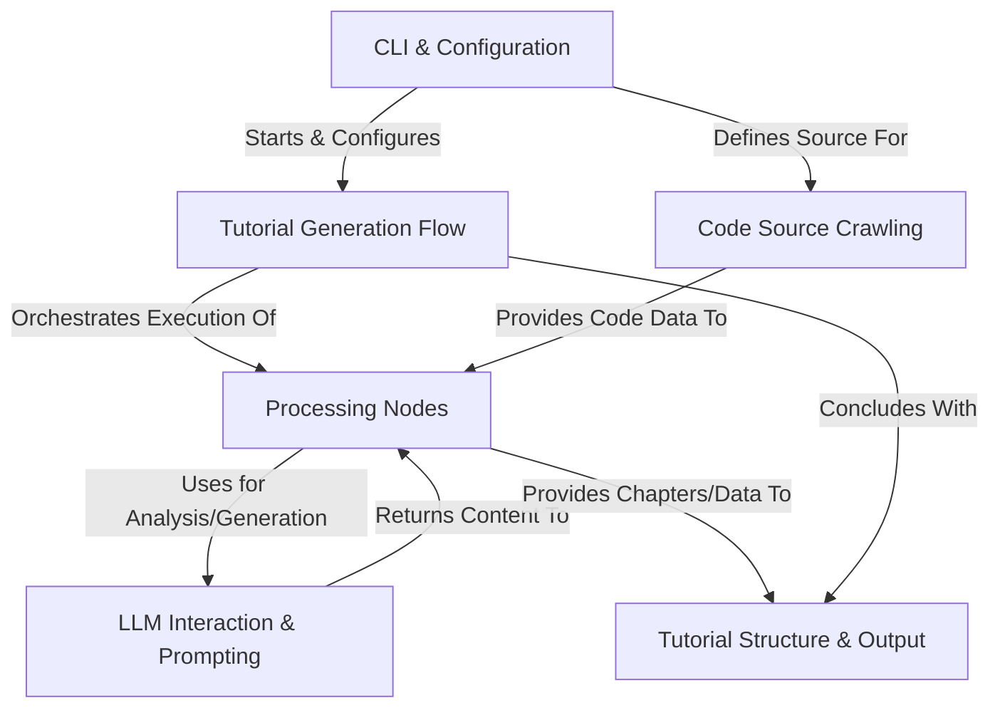

# Tutorial: Tutorial-Codebase-Knowledge

This project, `Tutorial-Codebase-Knowledge`, automates the creation of *beginner-friendly* tutorials for existing codebases. It utilizes a **pipeline** defined by the **Tutorial Generation Flow** (0), driven by user input via the **CLI & Configuration** (4). The flow orchestrates various **Processing Nodes** (1), starting with **Code Source Crawling** (2) to fetch code from GitHub or local directories. Subsequent nodes leverage **LLM Interaction & Prompting** (3) to analyze the code, identify key abstractions, determine their relationships, and write explanatory chapters. Finally, the flow concludes by generating the **Tutorial Structure & Output** (5), producing a set of linked Markdown files.

**Source Repository:** [https://github.com/bta4935/Tutorial-Codebase-Knowledge](https://github.com/bta4935/Tutorial-Codebase-Knowledge)

## Chapters

1. [CLI & Configuration](01_cli___configuration_.md)
2. [Tutorial Generation Flow](02_tutorial_generation_flow_.md)
3. [Tutorial Structure & Output](03_tutorial_structure___output_.md)
4. [Code Source Crawling](04_code_source_crawling_.md)
5. [Processing Nodes](05_processing_nodes_.md)
6. [LLM Interaction & Prompting](06_llm_interaction___prompting_.md)

---

Generated by [AI Codebase Knowledge Builder](https://github.com/The-Pocket/Tutorial-Codebase-Knowledge)
